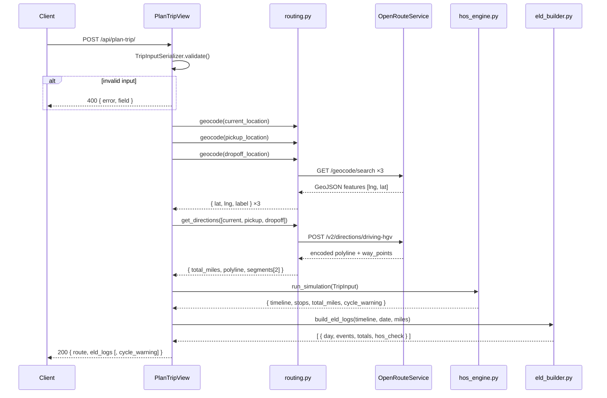
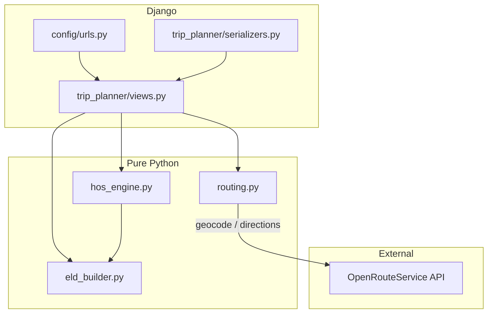
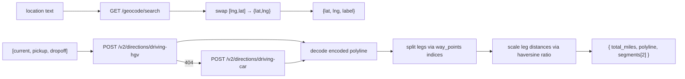
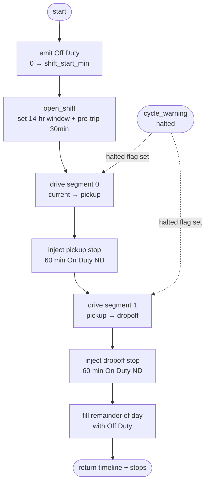
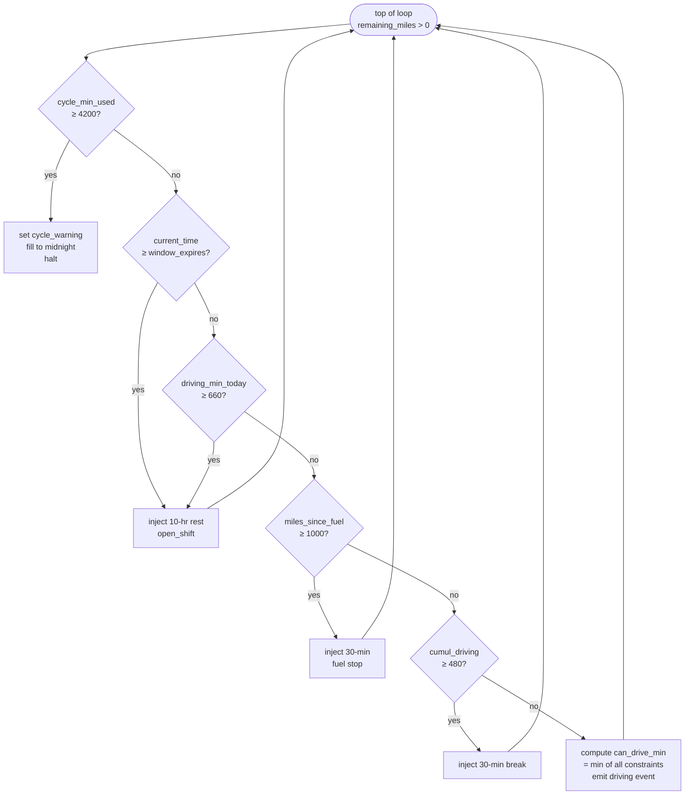
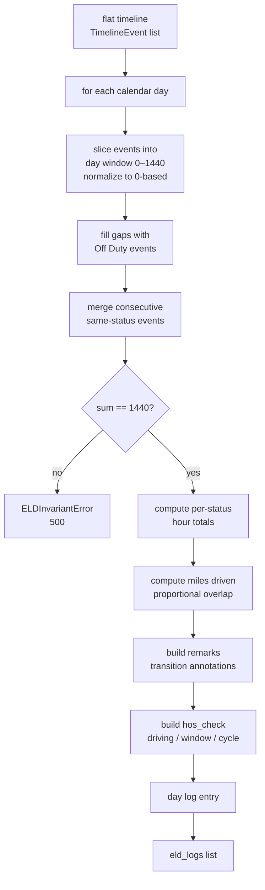

# Backend — System Architecture

Django 4.2 + Django REST Framework. Stateless — no database, no sessions, no auth. A single POST endpoint accepts trip parameters, runs the HOS simulation, and returns ELD log data.

---

## Request Lifecycle



---

## Module Dependency



---

## Modules

### `routing.py`
Pure Python, no Django imports. Wraps OpenRouteService.

- **`geocode(text, field_name)`** — `GET /geocode/search`. ORS returns GeoJSON `[lng, lat]`; swapped to `{lat, lng, label}`. Raises `RoutingError` on HTTP error or empty result.
- **`get_directions(waypoints)`** — `POST /v2/directions/driving-hgv` (falls back to `driving-car` on 404). ORS returns a Google-encoded polyline string (1e5 precision, not GeoJSON) — decoded inline with `_decode_polyline()`. Legs are split using `way_points` indices from the ORS response; leg distances are scaled proportionally from haversine ratios to preserve ORS road-distance accuracy.



---

### `hos_engine.py`
Pure Python. FMCSA 49 CFR §395.3 state machine. **All time is in absolute minutes from trip epoch (midnight of day 1).**

State variables tracked per simulation run:

| Variable | Max | Resets on |
|---|---|---|
| `driving_min_today` | 660 (11 hr) | 10-hr rest |
| `window_expires_min` | `window_start + 840` (14 hr) | 10-hr rest |
| `cumul_driving_since_break` | 480 (8 hr) | any non-driving event ≥ 30 min |
| `cycle_min_used` | 4200 (70 hr) | never |
| `miles_since_fuel` | 1000 | fuel stop |

#### Simulation Flow



#### Driving Loop Priority (per iteration)



Fixed stops (hardcoded durations, not user-configurable):

| Event | Status | Duration |
|---|---|---|
| Pre-trip inspection | On Duty ND | 30 min |
| Pickup | On Duty ND | 60 min |
| Dropoff | On Duty ND | 60 min |
| Fuel stop | On Duty ND | 30 min |
| 30-min break | On Duty ND | 30 min |
| Rest | Off Duty | 600 min (10 hr) |

Output: flat list of `TimelineEvent` objects spanning absolute minutes from epoch.

---

### `eld_builder.py`
Pure Python. Converts the flat absolute-time timeline into per-calendar-day ELD log entries.



---

## API Contract

### Request
```
POST /api/plan-trip/
Content-Type: application/json

{
  "current_location":  "Chicago, IL",
  "pickup_location":   "Dallas, TX",
  "dropoff_location":  "Los Angeles, CA",
  "current_cycle_used": 24.5          // hours used this 8-day cycle, 0–70
}
```

### Response (200)
```json
{
  "route": {
    "total_miles": 2407.3,
    "total_days": 3,
    "polyline": [[lat, lng], "..."],
    "stops": [
      {
        "type": "fuel",
        "label": "Fuel Stop",
        "location": "...",
        "lat": 0.0, "lng": 0.0,
        "day": 1,
        "time_of_day_min": 780,
        "duration_min": 30,
        "miles_mark": 998.4
      }
    ]
  },
  "eld_logs": [
    {
      "day": 1,
      "date": "2026-06-16",
      "miles_driven": 621.0,
      "events": [
        { "status": "off_duty",   "startMin": 0,   "endMin": 360 },
        { "status": "on_duty_nd", "startMin": 360, "endMin": 390 },
        { "status": "driving",    "startMin": 390, "endMin": 1050 }
      ],
      "totals": { "off_duty": 6.0, "driving": 11.0, "on_duty_nd": 0.5, "sleeper_berth": 0.0 },
      "remarks": [
        { "min": 0,   "text": "Chicago, IL — Off Duty" },
        { "min": 360, "text": "Chicago, IL — Pre-trip inspection" }
      ],
      "hos_check": {
        "driving_hrs": 11.0,
        "driving_limit": 11.0,
        "window_hrs": 11.5,
        "window_limit": 14.0,
        "cycle_used_after_day": 36.0,
        "cycle_limit": 70.0,
        "compliant": true
      }
    }
  ],
  "cycle_warning": "Driver exhausts 70-hr cycle on Day 2"
}
```

`cycle_warning` is omitted when the cycle limit is not reached.

### Error Response (400)
```json
{ "error": "Could not geocode location: 'xyzzy'", "field": "pickup_location" }
```

---

## Django Configuration

No database (`DATABASES = {}`). No auth app — `UNAUTHENTICATED_USER = None` and empty `DEFAULT_AUTHENTICATION_CLASSES` prevent DRF from importing `django.contrib.auth`.

CORS: `CORS_ALLOW_ALL_ORIGINS = True` in DEBUG mode; `CORS_ALLOWED_ORIGINS` from env in production. `CorsMiddleware` must remain first in `MIDDLEWARE`.

Env vars (loaded from `backend/.env` via python-dotenv):

| Variable | Required | Description |
|---|---|---|
| `ORS_API_KEY` | Yes | OpenRouteService API key |
| `SECRET_KEY` | Prod | Django secret key |
| `DEBUG` | No | `True` (default) or `False` |
| `ALLOWED_HOSTS` | Prod | Comma-separated hostnames |
| `CORS_ALLOWED_ORIGINS` | Prod | Comma-separated frontend origins |

---

## Running Locally

```bash
cd backend
python -m venv venv && venv\Scripts\activate
pip install -r requirements.txt
cp .env.example .env          # fill in ORS_API_KEY
python manage.py runserver    # http://localhost:8000
```
